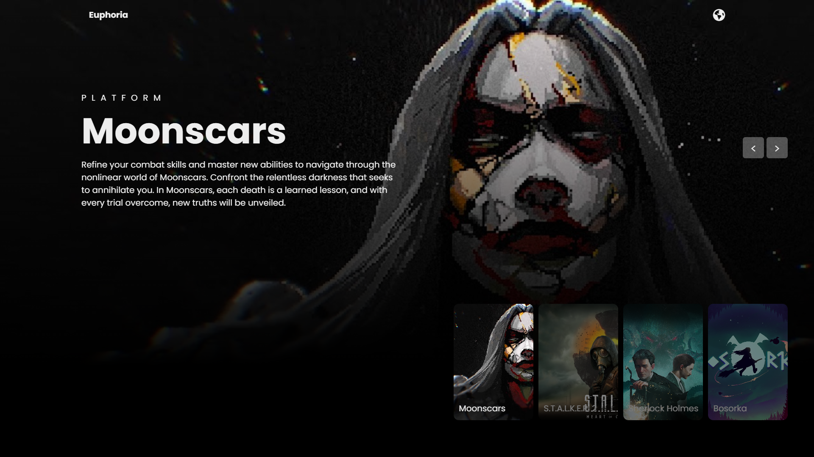

# JavaScript Image Slider

This is a simple image slider website that I developed using HTML, CSS, and JavaScript. The website showcases a collection of what I believe are the best Ukrainian games, with descriptions, titles, and genres, and offers language switching functionality. It also features basic image navigation functionality: automatic transitions, navigation through buttons, and manual switching by clicking on images in the thumbnail menu. This website is also responsive and optimized for mobile devices.

## Usage

To use this project, you need to:

1. Download or clone this repository.
2. Place your images in the "images" folder in the following format "img-<number>.jpg".
3. Update the data for the images in the "data-en.json" and "data-uk.json" files.

You can also add your own languages by creating a JSON file with a similar format and adding the two-letter initials to the "currentLanguage" variable options.

## Screenshots

## Credits

I got the inspiration for this project from a tutorial on a YouTube channel. You can check out the tutorial [here](https://www.youtube.com/watch?v=iBcjzaOvE94).

## Contact

For any questions or suggestions regarding this project, feel free to contact me via [LinkedIn](https://www.linkedin.com/in/bohdan-rudenko-b5726928a/).
