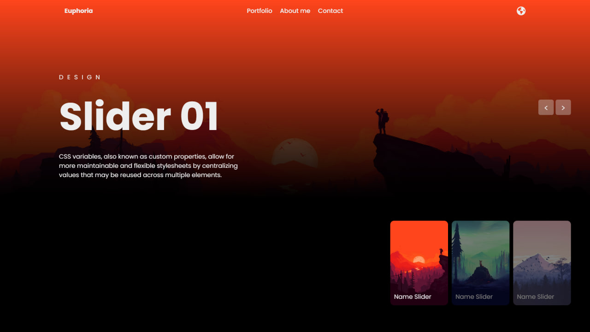

# JavaScript Image Slider

This is a simple image slider website that I developed using HTML, CSS, and JavaScript. The project features a header with links for navigation and a language switch button. The main content consists of a fullscreen image that automatically transitions. At the bottom of the screen, there are cards with smaller images, allowing users to manually switch between images. Additionally, two buttons for navigating forward and backward through the images have been implemented.

## Usage

To use this project, follow these steps:

1. Download or clone the repository.
2. Add a folder named "images" to the root directory.
3. Place your images in the "images" folder with the following naming format: "img-<number>.jpg".

## Screenshots

## Credits

I got the inspiration for this project from a tutorial on a YouTube channel. You can check out the tutorial [here](https://www.youtube.com/watch?v=iBcjzaOvE94).

## Contact

For any questions or suggestions regarding this project, feel free to contact me via [LinkedIn](https://www.linkedin.com/in/your-linkedin-profile/).
